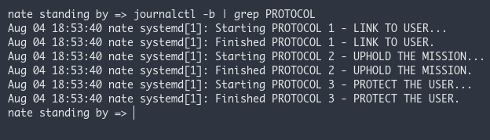

Print on boot, the 3 protocols that BT-7274 prints on the HUD in Titanfall 2 

1. Paste the service files in /etc/systemd/system or in any path in ```systemctl show --property=UnitPath```
2. enable the services

